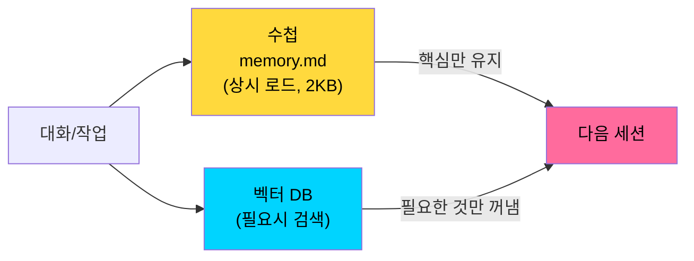

# 챗봇의 한계: 매 세션 태초 마을

> 챗봇(ChatGPT, Claude)은 **두뇌만** 있고 손발·해마가 없다.
> 헤르메스는 세 장기를 모두 갖춘 **직원**이다.

## 비교

| | 챗봇 | Hermes |
|---|---|---|
| **두뇌** (지능) | ✅ | ✅ |
| **손발** (실행) | ❌ | ✅ 20+ 도구 |
| **해마** (기억) | ❌ (매 세션 리셋) | ✅ 수첩 + 벡터 |
| **매뉴얼** (자기개선) | ❌ | ✅ skill.md |
| **채널** (게이트웨이) | 1개 (웹) | 20+ (Discord·Telegram·Slack) |
| **알람** (자동화) | ❌ | ✅ cron |
| **인격** (soul) | 시스템 프롬프트 | soul.md |

> "두뇌를 바꿔도 기억은 유지, 인격은 유지 — 두뇌만 교체 가능한 모듈"

---

# 🧠 7가지 부품

```mermaid
flowchart TB
    subgraph 장기["장기 (Long-term)"]
        B["두뇌<br/>config"]
        S["인격<br/>soul.md"]
        M["기억<br/>memory + user"]
        SK["업무 매뉴얼<br/>skill.md"]
    end

    subgraph 직원장치["직원화 장치"]
        T["손발<br/>tools"]
        C["채널<br/>20+ gateway"]
        CR["알람<br/>cron"]
    end

    U((사용자)) --> C
    C --> B
    B --> S
    S --> M
    M --> SK
    SK --> T
    CR -.자동 출근.-> B
    T -.결과.-> U

    style 장기 fill:#1a3a5c,stroke:#00d4ff,stroke-width:2px
    style 직원장치 fill:#5c1a3a,stroke:#ff6b9d,stroke-width:2px
    style B fill:#00d4ff,color:#000
    style S fill:#00d4ff,color:#000
    style M fill:#00d4ff,color:#000
    style SK fill:#00d4ff,color:#000
```

**앞 4개 = 장기** (교체해도 유지됨) · **뒤 3개 = 직원화 장치** (외부 인터페이스)

---

# 기억의 두 층위

| 층위 | 저장소 | 로드 시점 | 용량 |
|---|---|---|---|
| **수첩** | `memory.md` + `user.md` | 매 세션 자동 | 2천자 (압축) |
| **벡터** | OpenAI/Honcho | 필요시 검색 | 무제한 |

**Honcho 메모리**: 세션 종료 시 곱씹어 **말하지 않은** 선호까지 추론하여 기록

---

# 📈 Skill 복리 순환

```mermaid
flowchart LR
    A["첫 실행<br/>시행착오"] --> B["성공"]
    B --> C["skill.md<br/>자동 기록"]
    C --> D["재실행<br/>매뉴얼 참조"]
    D --> E["빠름"]
    E --> F["더 많은 경험"]
    F --> C

    style A fill:#5c1a3a,stroke:#ff6b9d
    style C fill:#1a3a5c,stroke:#00d4ff,stroke-width:3px
    style E fill:#3a5c1a,stroke:#ffd93d
```

> 챗봇: 매번 0에서 출발
> 헤르메스: 결과물이 다음 일의 출발점 → **복리**

⚠️ **과적합 주의**: 버릇이 굳을 수 있음 → 사용자가 주기적으로 매뉴얼 서랍 들여다보기

