# 🚀 3대 원칙

> **비용 제로(로컬) + 최고 성능(클라우드) + 데이터 오염 방지**

---

## 12 업무 × 4 분류

| 분류 | 업무 예시 | 최적 조합 | 결정 기준 |
|---|---|---|---|
| **📄 콘텐츠** | PPT, 카드뉴스, 마케팅, 영상 | Gemini, Hermes+Canva, Higgsfield | 구조화/시각화 |
| **💻 개발** | 데일리 코딩, 시스템 설계, 비전 분석 | Codex, Claude Sonnet | 지연 vs 지능 |
| **🔒 보안·연산** | 세금/재무, 온프레미스 관제 | OpenClaw + Ollama (100% 로컬) | 데이터 격리 |
| **🧠 지식·자동화** | ERP, 뉴스 브리핑, Wiki | Notion, Hermes+Obsidian | 요약 vs 원문 |

---

## 결정 매트릭스

```mermaid
flowchart TD
    q1{"데이터 민감도?"}
    q2{"실시간 응답<br/>필요?"}
    q3{"대규모 분석?"}

    q1 -->|High| local["💻 Ollama 로컬<br/>+ Hermes"]
    q1 -->|Low| q2
    q2 -->|Yes| codex["💻 Codex<br/>(Cursor)"]
    q2 -->|No| q3
    q3 -->|Yes| claude["☁️ Claude Sonnet"]
    q3 -->|No| google["☁️ Google Gemini<br/>+ Notion"]

    style local fill:#3a5c1a,stroke:#ffd93d,stroke-width:2px
    style codex fill:#1a3a5c,stroke:#00d4ff,stroke-width:2px
    style claude fill:#5c1a3a,stroke:#ff6b9d,stroke-width:2px
    style google fill:#3a1a5c,stroke:#a855f7,stroke-width:2px
```

핵심: **민감도 → 로컬 우선**, **응답속도 → Codex**, **깊은 분석 → Claude**, **문서/협업 → Google/Notion**

---

## 도구 생태계 (8종)

| 도구 | 역할 | 사용처 |
|---|---|---|
| **Ollama** | 로컬 LLM | 보안·연산, 지식 |
| **Hermes Agent** | 에이전트 오케스트레이션 | 콘텐츠, 자동화 |
| **Obsidian** | 마크다운 저장 | 비전, 지식 |
| **Notion** | 프론트엔드/PM | 마케팅, ERP |
| **Codex** | 실시간 코딩 | 데일리 코딩 |
| **Claude Code** | 대규모 분석 | 설계, 리팩토링 |
| **Google Gemini** | PPT/문서 | 콘텐츠 |
| **Higgsfield** | 영상 생성 | 마케팅 |

---

## 핵심 사례: 뉴스 브리핑

```mermaid
flowchart LR
    src["뉴스 원문"] -->|"스크랩"| hermes["Hermes"]
    hermes -->|"3줄 요약<br/>+ 태깅"| ollama["Ollama<br/>(로컬 LLM)"]
    ollama -->|"정형 데이터만"| obsidian["Obsidian<br/>(영구 저장)"]
    src -.폐기.-> raw["❌ 원문 버림"]

    style hermes fill:#1a3a5c,stroke:#00d4ff
    style ollama fill:#3a5c1a,stroke:#ffd93d
    style obsidian fill:#5c1a3a,stroke:#ff6b9d
    style raw fill:#5c1a1a,stroke:#ff0000
```

**컨텍스트 오염 방지**: 원문은 버리고 요약 + 태그만 저장 → LLM 컨텍스트가 깨끗하게 유지

