# ⚙️ 자동화 파이프라인

> 매일 정해진 시각 cron이 자동으로 출근 → 데이터 수집 → 멀티에이전트 분석 → 알림 전송 → 잠듦

---

## 하루 시간표 (KST)

```mermaid
gantt
    title 시스템 자동화 시간표 (KST)
    dateFormat HH:mm
    axisFormat %H:%M

    section 오전
    위키 동기화              :active, m1, 05:00, 5m
    일정 요약 (평일)          :crit, m2, 08:00, 5m
    시스템 점검               :milestone, m3, 08:30, 10m

    section 오후
    분석 체인 (평일)           :crit, m4, 18:35, 30m

    section 야간
    백업 + 정리              :milestone, m5, 23:30, 30m

    section 주간
    주간 계획 (월)            :milestone, w1, 08:30, 5m
    월간 리포트 (1일)         :milestone, w2, 08:00, 30m
    월간 검증 (5일)           :milestone, w3, 08:10, 30m
```

**KST = CST + 1h** · 평일 위주 운영 · 각 cron은 `deliver: "origin"` 권장 (404 회피)

---

## 데이터 흐름 (일반화)

```mermaid
flowchart LR
    cron["cron 출력<br/>(수집된 데이터)"] --> cap["capture.py<br/>→ snapshot.json"]
    cap --> filt["filter.py<br/>임계값 필터<br/>→ filtered_topN.json"]
    filt --> chain["main.py<br/>멀티에이전트 체인<br/>(LLM N calls)"]
    chain --> log["logs/analysis/<br/>YYYYMMDD_HHMM.json"]
    log --> rpt["report.py<br/>분할 리포트"]
    rpt --> notify["📱 알림 채널"]

    log --> alloc["allocator.py<br/>(1 call)"]
    alloc --> store["📊 current.json<br/>+ 일별 스냅샷"]

    style chain fill:#1a3a5c,stroke:#00d4ff,stroke-width:3px
    style notify fill:#5c1a3a,stroke:#ff6b9d
    style store fill:#3a5c1a,stroke:#ffd93d
```

**저장소 구조**: `~/.hermes/{snapshot, filtered, analysis, alloc, daily}/` — 각 단계마다 영구 보존

---

## 비용 구조 (월 예산 ₩30,000)

| 항목 | 비용 | 비율 |
|---|---:|---:|
| 멀티에이전트 체인 (N calls) | $1.20 | 9% |
| 자원 할당 LLM (1 call) | $0.02 | 0.2% |
| 월간 평가 (1 call) | $0.05 | 0.4% |
| 기존 크론 (브리핑/매크로 등) | $7.68 | 59% |
| **합계** | **$8.95 (₩12,978)** | **43%** |

💡 **V4 Flash** (DeepSeek) 사용 → 45 calls가 $0.054/회로 끝남 · 동일 품질 대비 95% 저렴

