# ⏰ 매일 23:30 CST 자동 실행

> 24종목 분석 → 포트폴리오 구성 → Discord 전송
> 매월 5일 성과검증 피드백 리포트

---

## 하루 시간표

```mermaid
gantt
    title Hermes Trading Pipeline (KST)
    dateFormat  HH:mm
    axisFormat %H:%M

    section 오전
    Analyst Target 수집       :milestone, m1, 08:10, 0m
    Orbit 적정주가            :milestone, m2, 08:30, 0m

    section 오후
    매크로 리포트              :milestone, m3, 18:30, 0m
    오후 브리핑                :milestone, m4, 19:00, 0m
    LangGraph 파이프라인        :crit, m5, 18:35, 30m

    section 야간
    매일 wiki 동기화           :active, m6, 05:00, 5m

    section 월간
    전략 리포트 (매월 1일)      :milestone, m7, 08:00, 30m
    성과 검증 (매월 5일)        :milestone, m8, 08:10, 30m
```

**KST = CST + 1h** · 평일 위주 운영 · 각 cron은 `deliver: "origin"` 권장 (404 회피)

---

## 데이터 흐름

```mermaid
flowchart LR
    CRON["cron 출력<br/>(Orbit/Target/매크로)"] --> CAP["capture_existing.py<br/>→ captured_snapshot.json"]
    CAP --> FILT["midpoint_filter.py<br/>Gap ≥ 30% 필터<br/>→ filtered_top10.json"]
    FILT --> LG["main.py<br/>LangGraph<br/>(DeepSeek 45 calls)"]
    LG --> LOG["logs/decisions/<br/>YYYYMMDD_HHMM.json"]
    LOG --> RPT["report.py<br/>split_reports()"]
    RPT --> DISC["📱 Discord<br/>종목별 FULL"]

    LOG --> PORT["portfolio_from_llm.py<br/>(1 call)"]
    PORT --> PORTF["📊 current.json<br/>+ 일별 스냅샷"]

    style LG fill:#1a3a5c,stroke:#00d4ff,stroke-width:3px
    style DISC fill:#5c1a3a,stroke:#ff6b9d
    style PORTF fill:#3a5c1a,stroke:#ffd93d
```

**저장소 구조**: `~/.hermes/portfolio/{current.json, daily/, monthly/}`

---

## 비용 (월 예산 ₩30,000)

| 항목 | 비용 | 비율 |
|---|---:|---:|
| LangGraph (45 calls) | $1.20 | 9% |
| 포트폴리오 LLM (1 call) | $0.02 | 0.2% |
| 월간 평가 (1 call) | $0.05 | 0.4% |
| 기존 크론 (브리핑/매크로) | $7.68 | 59% |
| **합계** | **$8.95 (₩12,978)** | **43%** |

💡 **DeepSeek V4 Flash** 사용 → 45 calls가 $0.054/회로 끝남

