# 🧠 LangGraph: 5단계 분석

> 9종목 × 5 calls = **45 calls** · Context → Bull → Bear → Risk → **Decision**

---

## 5단계 플로우

```mermaid
flowchart LR
    IN["종목 데이터<br/>(gap, moat, sector)"] --> CTX["1. Context<br/>환경 분석"]
    CTX --> BULL["2. Bull<br/>강세 논거"]
    CTX --> BEAR["3. Bear<br/>약세 논거"]
    BULL --> RISK["4. Risk<br/>하락 시나리오"]
    BEAR --> RISK
    RISK --> DEC["5. Decision<br/>최종 결정<br/>(매수/매도/비중)"]

    CTX -.맥락 제공.-> DEC

    style CTX fill:#1a3a5c,stroke:#00d4ff
    style BULL fill:#3a5c1a,stroke:#ffd93d
    style BEAR fill:#5c1a3a,stroke:#ff6b9d
    style RISK fill:#5c3a1a,stroke:#ff8c00
    style DEC fill:#5c1a5c,stroke:#a855f7,stroke-width:3px
```

각 단계는 **독립 LLM call** · 결과는 다음 단계의 입력 + Decision에 직접 전달

---

## Decision 출력

| 입력 | 출력 |
|---|---|
| 종목별 Bull/Bear/Risk 요약 | 종목별 비중 (0~20%) |
| 매크로 지표 (VIX, 10Y, DXY) | 현금 비중 (10~90%) |
| 해자 등급 (Wide/Narrow/None) | 포트폴리오 전체 근거 |
| Gap % (저평가/고평가) | 리스크 요인 |

---

## 비용 최적화

| 항목 | 값 |
|---|---:|
| **1회 비용** | **$0.054** |
| 종목당 calls | 5 |
| 일일 호출 (10종목) | 50 |
| 월 비용 (22 영업일) | $1.20 |
| **월 예산 대비** | **4%** |

💡 **V4 Flash** (DeepSeek) = 동일 품질 대비 95% 저렴

