# 🔗 5단계 분석 체인

> N개 × 5 calls · Context → 4-Agent (Positive / Negative / Risk / Trade-off) → **Conclusion**

---

## 5단계 플로우

```mermaid
flowchart LR
    input["입력 데이터<br/>(context, scores, metrics)"] --> ctx["1. Context<br/>환경 분석"]
    ctx --> pos["2. Positive<br/>강세 논거"]
    ctx --> neg["3. Negative<br/>약세 논거"]
    pos --> risk["4. Risk<br/>하락 시나리오"]
    neg --> risk
    neg --> trade["5. Trade-off<br/>상충 트레이드오프"]
    pos --> trade
    risk --> concl["6. Conclusion<br/>최종 결정"]
    trade --> concl

    ctx -.맥락 제공.-> concl

    style ctx fill:#1a3a5c,stroke:#00d4ff
    style pos fill:#3a5c1a,stroke:#ffd93d
    style neg fill:#5c1a3a,stroke:#ff6b9d
    style risk fill:#5c3a1a,stroke:#ff8c00
    style trade fill:#3a3a5c,stroke:#a855f7
    style concl fill:#5c1a5c,stroke:#a855f7,stroke-width:3px
```

각 단계는 **독립 LLM call** · 결과는 다음 단계의 입력 + Conclusion에 직접 전달

---

## Conclusion 출력

| 입력 | 출력 |
|---|---|
| Positive/Negative 요약 | 권장 액션 |
| Risk 시나리오 | 신뢰도 (%) |
| Trade-off 매트릭스 | 대안 옵션 |
| 메트릭/스코어 | 근거 설명 |

---

## 비용 최적화

| 항목 | 값 |
|---|---:|
| **1회 비용** | **$0.054** |
| 분석당 calls | 5~6 |
| 일일 호출 (N건) | N × 6 |
| 월 비용 (22 영업일) | $1.20 |
| **월 예산 대비** | **4%** |

💡 **V4 Flash** (DeepSeek) = 동일 품질 대비 95% 저렴 · temperature=0.3으로 일관성 확보

