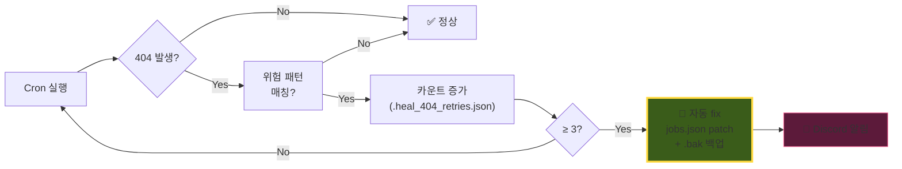

# ⏰ 9개 Cron Jobs

> KST = CST + 1h · `deliver: "origin"` 권장 (Home 채널 404 회피)

---

## 평일 시간표

```mermaid
gantt
    title Daily Cron Schedule (KST)
    dateFormat HH:mm
    axisFormat %H:%M

    section 아침
    wiki 동기화              :active, w1, 05:00, 5m
    일정 요약 (평일)           :crit, s1, 08:00, 5m
    오전 포트폴리오           :milestone, s2, 08:10, 10m

    section 오후
    매크로 리포트             :milestone, s3, 18:30, 5m
    LangGraph 파이프라인       :crit, s4, 18:35, 30m
    미국 증시 브리핑           :milestone, s5, 19:00, 10m

    section 주말/월말
    주간 계획 (월)            :milestone, s6, 08:30, 5m
    전략 리포트 (1일)          :milestone, m1, 08:00, 30m
    성과 검증 (5일)            :milestone, m2, 08:10, 30m
```

전체 cron 목록: `~/.hermes/wiki/infra/cron-jobs.md`

---

## Deliver 패턴 가이드

| 패턴 | 결과 | 권장 |
|---|---|:---:|
| `"origin"` | 현재 thread 자동 라우팅 | ✅ 12건 |
| `"discord:{HomeID}:{threadId}"` | 명시적 thread | ✅ 8건 |
| `"local"` | 로컬 저장만 | ⚪ 5건 |
| `"discord:{HomeID}"` (스레드 없음) | **404 확정** | ❌ 0건 |

---

## 🛡 Self-Healing Watchdog

> 404 + 위험 deliver 패턴 **3회 누적 시** → 자동 origin patch + Discord 알림

**변경 위치**: `~/.hermes/scripts/self_healing_watchdog.sh` + `trade-pipeline/langgraph/scripts/_infra_backup/` (git 추적)

