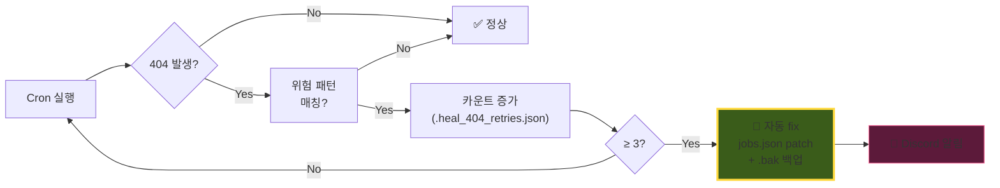

# ⏰ Cron 자동 알람

> 정해진 시각에 시스템이 **자동으로 출근** → 작업 → 결과 보고 → 잠듦

---

## 시스템 운영 시간표

```mermaid
gantt
    title 시스템 운영 Cron (KST)
    dateFormat HH:mm
    axisFormat %H:%M

    section 매일
    위키 동기화              :active, d1, 05:00, 5m
    일정 요약 (평일)          :crit, d2, 08:00, 5m

    section 평일 오후
    분석 체인 (평일)          :crit, d3, 18:35, 30m

    section 주간
    주간 계획 (월요일)        :milestone, w1, 08:30, 5m

    section 월간
    월간 리포트 (매월 1일)     :milestone, m1, 08:00, 30m
    월간 검증 (매월 5일)       :milestone, m2, 08:10, 30m
```

전체 cron 목록: `~/.hermes/wiki/infra/cron-jobs.md`

---

## Deliver 패턴 가이드

| 패턴 | 결과 | 권장 |
|---|---|:---:|
| `"origin"` | 현재 thread 자동 라우팅 | ✅ 다수 |
| `"discord:{HomeID}:{threadId}"` | 명시적 thread | ✅ 다수 |
| `"local"` | 로컬 저장만 | ⚪ 일부 |
| `"discord:{HomeID}"` (스레드 없음) | **404 확정** | ❌ 금지 |

---

## 🛡 Self-Healing Watchdog

> 404 + 위험 deliver 패턴 **3회 누적 시** → 자동 origin patch + Discord 알림

**변경 위치**: `~/.hermes/scripts/self_healing_watchdog.sh` + `trade-pipeline/_infra_backup/` (git 추적)

