# 🎯 SSoT: Single Source of Truth

> 모든 데이터를 하나의 기준으로 통합해, 동일한 정보 위에서 판단할 수 있게 만드는 구조

---

## 4대 속성

```mermaid
flowchart TB
    SSoT["SSoT<br/>단일 진실 공급원"]

    SSoT --> C1["Centralization<br/>분산 데이터를 단일 플랫폼에 통합"]
    SSoT --> C2["Consistency<br/>수정이 전체에 동시 반영"]
    SSoT --> C3["Integrity<br/>언제든 동일한 기준으로 접근"]
    SSoT --> C4["Accurate Decision<br/>의사결정 속도·정확도 동시 상승"]

    style SSoT fill:#5c1a5c,stroke:#a855f7,stroke-width:4px
    style C1 fill:#1a3a5c,stroke:#00d4ff
    style C2 fill:#3a5c1a,stroke:#ffd93d
    style C3 fill:#5c3a1a,stroke:#ff8c00
    style C4 fill:#5c1a3a,stroke:#ff6b9d
```

---

## HR 데이터가 SSoT 중심인 이유

> 매출·생산성 = 결과만 보여줌
> **원인(조직 개편, 인력 변화)** = HR 데이터에 있음

| 데이터 종류 | 보여주는 것 | 못 보여주는 것 |
|---|---|---|
| 매출/생산성 | 결과 | 원인 |
| HR 데이터 | 맥락·관계 | 정량 지표 |
| **SSoT (HR 중심)** | **원인-결과 통합** | — |

⚠️ **협업툴≠SSoT 함정**: Notion·Slack·Docs는 이벤트 로그만 남기고 HR 맥락이 없음 → 판단 근거로 작동 못함

---

# 🗂 Wiki Super Repo

```mermaid
graph TD
    SUPER["hermes-wiki-super<br/>(super repo)"]

    SUPER --> W1["hermes-wiki<br/>(Index + 운영)"]
    SUPER --> W2["hermes-wiki-claude-code"]
    SUPER --> W3["hermes-wiki-codex"]
    SUPER --> W4["hermes-wiki-schedule"]
    SUPER --> W5["hermes-wiki-portfolio"]
    SUPER --> W6["hermes-slash-commands"]
    SUPER --> W7["hermes-logs<br/>(변경 이력)"]

    W1 --> R1["architecture/"]
    W1 --> R2["analysis/"]
    W1 --> R3["infra/"]
    W1 --> R4["watchlist/"]

    style SUPER fill:#5c1a5c,stroke:#a855f7,stroke-width:4px
    style W1 fill:#1a3a5c,stroke:#00d4ff
    style W7 fill:#5c1a3a,stroke:#ff6b9d
```

**SSoT 원칙 적용**: `hermes-wiki`가 index 역할, submodules가 도메인 데이터 담당

